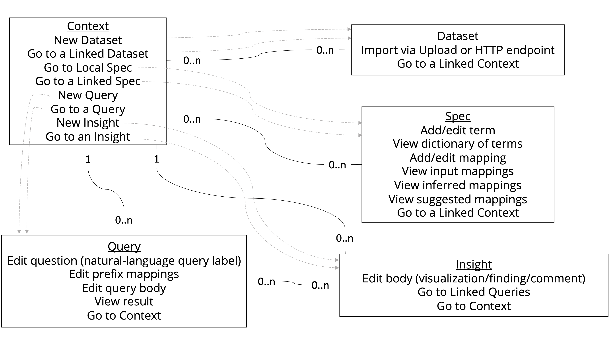

`maggtomic` (*m*etadata *agg*regation using the Da*tomic* information model) is intended to be a
modular system for metadata management.

The primary near-term use case is support of metadata submission, processing, and management for the
[National Microbiome Data Collaborative (NMDC)](https://microbiomedata.org/) pilot project. A priority of
this project is the cultivation of an open (and open-source-powered) data ecosystem.

# Development Status

The development status is currently a mix of Planning and Pre-Alpha (as per
https://pypi.org/classifiers/).

# Assumptions and Design Considerations

A priority for `maggtomic` is agility. The system must be extensible, with little impedance, to ongoing
introduction of a wide variety of data sources and sinks, all of which need to be findable, accessible,
interoperable, and reusable ([FAIR](https://doi.org/10.1038/sdata.2016.18)).

The [Datomic information model](https://www.infoq.com/articles/Datomic-Information-Model/) facilitates
such agility via its singular, universal relation. It extends the W3C standard
Resource Description Framework ([RDF](https://www.w3.org/TR/2014/REC-rdf11-concepts-20140225/)) information
model, which was designed to facilitate interoperability of distributed data,
with minimal annotation to support ACID transactions. These transactions are reified as durable entities and thus
 may be annotated with provenance, enabling historical auditing and qualified reproducibility. Each and
 every fact-as-of-now (a so-called *datom*) is recorded as a 5-tuple: an RDF triple of entity-attribute-value,
 a transaction id (annotated with
 the transaction wall time as a separate fact), and whether the fact is an assertion or retraction.

## Choosing MongoDB and Python

To implement the Datomic information model in an open-source system that facilitates agility
for the motivating near-term use case -- supporting the NMDC pilot project -- the most important operational
considerations are familiarity and manageability (see: familiarity) with the chosen technology. `maggtomic`
chooses MongoDB. Why? 
- Much of the infrastructural support for NMDC is located at two U.S. Dept. of Energy (DOE)
user facilities: Joint Genome Institute (JGI) and National Energy Research Scientific Computing Center (NERSC).
The JGI Archive and Metadata Organizer (JAMO), which in turn uses NERSC hardware and staff support,
manages user-facing metadata with MongoDB.
- Other large user-facing facilities use MongoDB for (meta)data management through NERSC,
such as the Advanced Light Source (ALS) user facility and the
Materials Project ([MP](https://materialsproject.org/)).
- Another large project with a focus on biological metadata management, the
Center for Expanded Data Annotation and Retrieval (CEDAR),
uses MongoDB [as a metadata repository](https://doi.org/10.1093/database/baz059).

So, there is strong operational familiarity among relevant stakeholders both at the level of infrastructure
support and of suitability for scientific-domain modeling. But what about system features necessary to
support adequate performance of the Datomic information model? Firstly, `maggtomic` is intended to support
the needs of a pilot project, so *adequate* is an important qualifier on expected performance. Secondly, there
are several features of MongoDB, and choices for configuration, that help address performance concerns:
- *redundant indexing to support a variety of access patterns*: Datomic redundantly stores all data in at
least 4 sort orders, including one index that covers a subset of datoms to support reverse attribute lookup. This
redundancy is to flexibly support key-value-store-oriented, row-oriented, column-oriented, document-oriented,
and graph-oriented access patterns in the same system.
For this functionality, MongoDB supports multiple (covering) compound indexes, and partial indexes,
on a collection.
- *compression*: Because (a) all data is stored redundantly in each of several indexes, and (b) all data is
immutable (accumulate-only, great for historical auditing and qualified reproducibility), Datomic index segments
are highly compressed. With the MongoDB (default) WiredTiger storage engine, compression is supported for all
collections and indexes, with different options to trade off higher compression rates versus CPU usage. The
`zstd` library available in MongoDB 4.2 seems appropriate here, with a higher compression rate than the default
`snappy` option and lower CPU usage (and also higher compression rate) than the `zlib` option (previously the
only built-in alternative to `snappy`). Furthermore, indexes for WiredTiger collection are prefix-compressed
by default: queries against an index, including covering queries, operate directly on the compressed index --
i.e., it remains compressed in RAM.
- *fixed-space identifiers rather than redundant string storage*: A separate mechanism for space reduction in Datomic
is the storage of
entity references as numbers rather than storing larger string values. This is particularly important when
using the distributed-data model of RDF and thus using fully qualified names. MongoDB supports this space reduction
strategy, either via the built-in 12-byte ObjectId reference type, or via an alternative strategy such as
[Crockford's Base32](https://www.crockford.com/base32.html) for deserializable-for-humans numerical entity IDs.
- *transactions*: A performance concern in the sense that losing data is poor performance (!). MongoDB supports
multi-document transactions as of 4.0 (and across a sharded deployment as of 4.2), and configurable write- and
read-concern levels.

There is also the matter of supporting analogues to Datomic schema, query, and
transaction functions, all of which in turn support effective and productive interaction with the underlying
information model. `maggtomic` chooses Python as the language for client interfaces, as this language
is in heavy use by stakeholders.
- For schema support, rather than translate the ad hoc vocabulary used in
Datomic, `maggtomic` aims to support a subset of the RDF-based W3C Shapes Constraint Language
([SHACL](https://www.w3.org/TR/shacl/)) standard, which admittedly was only finalized as a standard in 2017,
whereas Datomic schema was launched earlier. Crucially, Python tooling such as
[pySHACL](https://github.com/RDFLib/pySHACL) exists to validate SHACL shape graphs against data graphs.
Various SHACL node shapes can be checked -- these are analogous to JSON Schema documents, with the
advantage of structural sharing-by-reference of SHACL property shapes, whereas the equivalent of
property shapes need to be restated for each JSON Schema document. Through this mechanism, for example,
a metadata submission can conform to multiple "templates", and suggestions can be derived to bring a
submission to compliance with one or more templates not initially considered by a submitter.
- For query, `maggtomic` aims to leverage the expressiveness of the MongoDB query language and the MongoDB
aggregation pipeline to provide a query interface similar in appearance and composability to Datomic's
variant of datalog.
- For transaction functions, `maggtomic` aims to provide Python functions that return e.g. lists of
dictionaries that correspond to tiny MongoDB documents as new datoms, MongoDB aggregation pipeline stages, etc.
Modulo performance considerations, transaction functions or query predicates may be arbitrary Python functions,
as their equivalents may be arbitrary Clojure functions in Datomic, which would manifest e.g. as interruptions
of a MongoDB aggragation pipeline.

Certainly, not all of the above things need to be implemented prior to productive evaluative use of an
alpha version of `maggtomic`, but it's important to consider longer-term ramifications of choosing Python
and MongoDB to implement
([an ad hoc, informally-specified, bug-ridden, slow implementation of half of](https://en.wikipedia.org/wiki/Greenspun%27s_tenth_rule)) the commercial Datomic offering,
even if one knows the motivating use case is for agility in the context
of a pilot system and thus one must
[plan to throw one away; you will, anyhow.](https://www.tbray.org/ongoing/When/200x/2008/08/22/Build-One-to-Throw-Away)

Finally, `maggtomic` aims to provide interoperability among data sources and
sinks via translation between JSON-LD serializations (as JSON is a familiar
format for stakeholders) and the RDF graphs corresponding to values of the
`maggtomic` database as-of given times (and thus as a set of
entity-attribute-value tuples for a given filtration of transactions). Again,
Python tooling for this translation is crucial, and e.g. the
[pyLD](https://github.com/digitalbazaar/pyld) library is a JSON-LD processor
that supports necessary operations such as expansion+flattening --
context-annotated JSON-LD to RDF -- and framing(+compacting) -- RDF to
context-annotated JSON-LD, which can leverage specs, e.g. SHACL shape-graph
schemas and ontologies, installed as facts-as-of-now themselves in the database.

Dataflow may be handled via "builder" ETL processes as with the Materials
Project's [maggma](https://github.com/materialsproject/maggma) system. Though
currently out of scope for the near-term, it may be possible to construct a
[timely dataflow](https://timelydataflow.github.io/timely-dataflow/) system to
support adequately-performant interactive queries of the knowledge graph
embodied by a `maggtomic` database. The [tuple space
model](https://software-carpentry.org/blog/2011/03/tuple-spaces-or-good-ideas-dont-always-win.html)
(e.g. [Linda](https://www.inf.ed.ac.uk/teaching/courses/ppls/linda.pdf)) of
parallel programming may also be fruitful here.

For Web API support for metadata submission and search/retrieval,
`maggtomic` aims to include a [FastAPI](https://fastapi.tiangolo.com/) server module. For browser-based
metadata submission and basic search/retrieval, `maggtomic` aims to include a (authentication-enabled)
static-site frontend that connects to the Web API.

# Breadboard for user interface

Below is a
[breadboard](https://basecamp.com/shapeup/1.3-chapter-04#breadboarding) sketch
for the `maggtomic` user interface (UI). Each *place* has *affordances*, and the
*connection lines* show how affordances take a user from place to place. In
addition, here each place represents an entity, and the breadboard doubles as an
entity relationship diagram (ERD) with relationship multiplicities labeled on
the solid edges between entities. Examples: a *context* associates with zero or
more ("0..n") *datasets*, a *query* associates with one and only one ("1")
*context*, etc.

Each of these entities are described in more detail below as part of the use
cases illustrated by sequence diagrams.

Furthermore, the choice of entities and their relationships was inspired by
the [data.world](https://data.world/) catalog service.

# Sequence diagrams for use-case "happy paths"

Below are sequence diagrams for a core set of use cases. Each diagram sketches
out a "happy path" and can be used as a checklist for a
[spike](https://wiki.c2.com/?SpikeSolution), where each arrow in a diagram
corresponds to one checklist item.

## Create new context

A *context* can be likened to a "project" or "analysis", in that it serves as a
mechanism to collect information, ask questions about it, and communicate
answers. It's called a context because (a) it isn't limited to one focused
activity with a beginning, middle, and end, as is the case for a project or
analysis; and (b) it's intent is similar to that of a [JSON-LD
context](https://www.w3.org/TR/json-ld11/#the-context):

> When two people communicate with one another, the conversation takes place in
a shared environment, typically called "the context of the conversation". This
shared context allows the individuals to use shortcut terms, like the first name
of a mutual friend, to communicate more quickly but without losing accuracy. A
context in JSON-LD works in the same way. It allows two applications to use
shortcut terms to communicate with one another more efficiently, but without
losing accuracy.

Specifically, a `maggtomic` context is used to map terms and relationships
among datasets linked to the context. The below diagram shows a user story for
creating a new context.

## Import new dataset

A *dataset* is an RDF graph, i.e. a set of entity-attribute-value pairs for
which all entities and attributes are URIs, and values are either URIs or data
literals (strings, numbers, etc.). A dataset can be used in many
contexts, and a context can link to many datasets.

To import a new dataset into *maggtomic*, a user does so from a working context;
other contexts may later also link to and thus use the dataset. A dataset may be
uploaded, or HTTP endpoint information can be provided. For example, a URL can
be entered for a simple GET request. More complex endpoint registration could be
supported, such as using a POST request, providing authentication and other
headers, asking that the dataset be re-fetched via the endpoint periodically,
etc.

A user can import a dataset in non-RDF form, for example as a collection of TSV
tables or as a collection of JSON documents. In this case, the dataset will be
*atomized*, that is, destructured to atomic statements of the form
entity-attribute-value. URIs for a newly atomized dataset's entities and
attributes are prefixed using the user's `maggtomic` user/organization name and
the context's slug, e.g.
`http://maggtomic-host.example.com/awesomeorg/my-great-context`, analogous to
the namespacing of e.g. GitHub code repositories.

The below diagram shows a user story for importing a new dataset.

## Import new spec

An *spec* (for "specification") is a power-up for datasets that increases their
<a href="https://doi.org/10.1038/sdata.2016.18">FAIR</a>ness. A spec is also an
RDF graph, and can represent something to be "applied" to a dataset, meaning
additional facts are inferred from the dataset in this context -- that is, after
verifying that the dataset doesn't contain facts that contradict with the spec.
A spec of this kind is also called an *ontology*.

A spec can also be something a dataset is validated against for conformance,
e.g. a *schema* (called a *shape* in SHACL). A dataset needn't be conformant to
all such linked specs in a context; rather, linking them can help the
`maggtomic` system generate suggested mappings. Each context has a "local" spec
where a user can use the namespace of the context to manage a controlled
vocabulary (dictionary of terms) and mappings among terms. In this way, a user
can ensure dataset conformance to specs of interest.

The notion of "spec" here is inspired by that of
[clojure.spec](https://clojure.org/about/spec): represented just like datasets,
and more dynamic and flexible than a static system of types.

A central design goal of `maggtomic` is to facilitate the mapping of imported
datasets to shared specs. Thus, a user should be able to enter a context, import
their dataset, import a spec shared with them by a colleague (for example, the
[NMDC Schema](https://microbiomedata.github.io/nmdc-metadata/schema/)), and
establish mappings among terms. If another user has already imported a spec of
interest, that spec may be linked from other contexts.

The below diagram shows a user story for importing a new spec. The flow is
similar to that for importing a new dataset, but in this case no atomization is
needed, as specs are presumed to be imported as RDF-serialized.

## Suggest mappings

To support queries across datasets, a user must ensure mappings among terms in
their working context's linked datasets and spec (unless the datasets are
already linked through use of the same terms (URIs) for the same concepts -- the
dream of Linked Data!). Imagine a simple context of one dataset and one
spec: a user has imported a new dataset they wish to share with the
community, and has linked to a previously imported recommended spec from the
context where they imported their dataset. Now what?

A user can request suggestions for mappings from the `maggtomic` system. First,
the system should ensure that all inferences have been determined and persisted
given the context's linked datasets and specs. Inferences are
entity-attribute-value statements entailed by applying user-supplied ontology
specs to user-supplied data. In other words, *inferences* are mappings that are
already unambiguously implied by what the user supplied, so it would be
redundant to offer these mappings as *suggestions* to be confirmed for explicit
inclusion by the user in their context's local spec.

The below diagram shows a user story for requesting suggestions for mappings
to apply to a context's local spec.

## Apply mappings

A user can curate a context to provide a data dictionary of terms and mappings
that empower and ease the construction of readable queries across datasets.
Mappings may be suggested by `maggtomic`, or they may be entered manually,
in either case applied by a user.

Because datasets and specs are both represented as RDF, a user
can update a dataset to include spec statements as part of the dataset
itself, making it more readily interoperable. Hooray for Linked Data!

The below diagram shows a user story for applying mappings to a context's
local spec. The validation step ensures consistency with the
entailments of linked specs.

## Create query

The standard protocol and language for queries across RDF datasets is
[SPARQL](https://www.w3.org/TR/2013/REC-sparql11-overview-20130321/), for which
prefix mappings enable readable queries given URI terms. An alternative query
interface/language may be helpful, in particular one that is based on data
literals rather than strings, as is the case with Datalog's Clojure/EDN-based
datalog. [Eve](http://docs.witheve.com/v0.3/syntaxreference/) syntax is another
datalog variant that may be worth investigating. For `maggtomic`, the JSON-based
query and aggregation languages of MongoDB may prove fruitful for adaptation.

A query is labeled with a natural-language question, to facilitate user
navigation and search for relevant queries that lead the user to relevant
contexts and datasets.

The below diagram shows a user story for saving and running a query across one
or more datasets of a working context.

## Create insight

An insight is a lightweight annotation for a context that communicates some
result and its significance. It is a "post" by a user, with text and perhaps
included visualizations in the form of e.g. PNG images. Ideally, an insight
links to one or more specific queries of the context that support the insight.

No sequence diagram is shown yet for creating an insight because this is not
considered a core use case for a minimum viable product (MVP) demo of
`maggtomic`. Thus, it is not crucial at this time to sketch out a checklist for
a spike that demonstrates this feature.